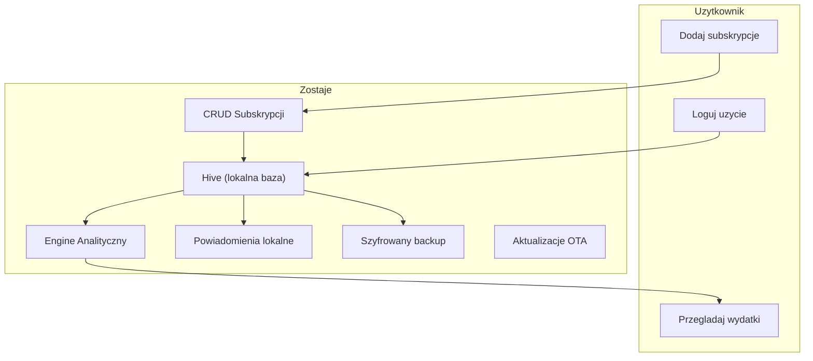

# Architektura

> **Powiazane:** [Roadmap](roadmap.md) | [Baza Danych](database.md) | [Bezpieczenstwo](security.md)
> | [Konwencje](standards/conventions.md)
>
> **ADR:** [ADR-001 Hive JSON bez code-gen](adr/ADR-001-hive-json-bez-code-gen.md)

---

## Przeglad Systemu



### Przeplyw danych

1. **CRUD subskrypcji:** Uzytkownik dodaje/edytuje subskrypcje -> zapis do Hive
2. **Usage tracking:** Uzytkownik loguje uzycie ("Uzylem dzisiaj") -> zapis do Hive
3. **Analityka:** Engine oblicza: total miesieczny, koszt/uzycie, ghost subscriptions, trendy
4. **Powiadomienia:** Lokalne notyfikacje o zblizajacych sie odnowieniach i ghost alerts
5. **Backup:** Eksport szyfrowany (AES-256-GCM) do pliku

---

## Stack Technologiczny

| Warstwa | Technologia |
|---------|-------------|
| **Framework** | Flutter (Dart) |
| **UI** | Material Design 3 — "Aurora", jeden ciemny motyw (ADR-005); design tokens + straznik (ADR-007) |
| **Lokalna baza** | Hive (NoSQL, offline-first) |
| **State management** | ChangeNotifier + Provider |
| **Szyfrowanie** | AES-256-GCM (pointycastle) |
| **Aktualizacje** | OTA (ota_update + version.json) |
| **Wykresy** | fl_chart |
| **Powiadomienia** | flutter_local_notifications |
| **PDF** | pdf + printing |
| **Ikony** | Lucide Icons Flutter |

---

## Struktura katalogow

```text
lib/
├── config/
│   └── app_config.dart          # Build-time config (channels, URLs)
├── controllers/
│   ├── subscription_controller.dart # Stan subskrypcji (CRUD + analytics)
│   ├── budget_controller.dart   # Aktywny budzet i tryb, odhaczenia platnosci, kaskady slownikow (plan)
│   ├── plan_controller.dart     # Plan roczny aktywnego budzetu (ADR-035): pozycje, miesiace, karta, plan na kolejny rok
├── models/
│   ├── subscription.dart        # Glowna encja + PaymentMethod
│   ├── category.dart            # Kategorie subskrypcji
│   ├── usage_event.dart         # Logowanie uzycia
│   ├── budget_entry.dart        # Stara pozycja budzetu — archiwum i zrodlo konwersji (ADR-035); BudgetScope, BudgetMode
│   ├── cashflow.dart            # Przeplywy dnia kalendarza (CalendarItem, DayCashflow)
│   ├── plan_position.dart       # Plan roczny: pozycja z miesiacami „RRRR-MM → kwota" (ADR-035)
├── utils/
│   ├── cycle_math.dart          # Wspolna normalizacja cyklu -> kwota/mies + projekcja wystapien (ADR-020)
├── services/
│   ├── app_logger.dart          # Circular log buffer
│   ├── backup_crypto_service.dart # Szyfrowanie kopii (AES-256-GCM) + kod odzyskiwania (ADR-024)
│   ├── cloud_backup_service.dart # Kopia w ukrytym folderze na Dysku Google, automat raz na dobe (ADR-024)
│   ├── recovery_key_vault.dart  # Sejf na kod odzyskiwania w koncie Google (Block Store)
│   ├── storage_service.dart     # Hive + cache + CRUD
│   ├── analytics_service.dart   # Obliczenia subskrypcji: totale, trendy, breakdown
│   ├── plan_conversion.dart     # Konwersja starych pozycji na plan roczny + raport zgodnosci (ADR-035); stare dane nietkniete
│   ├── plan_service.dart        # Obliczenia planu: kwoty okresu, sumy miesiaca, statystyki roku, kalendarz, subskrypcje w miesiacach
│   ├── excel_service.dart       # Import/eksport .xlsx: subskrypcje + plan (udostepnianie, wybor pliku)
│   ├── plan_excel.dart          # Plan w arkuszu: tabela roku (pozycje x 12 miesiecy, arkusz na rok) — budowa i odczyt (ADR-035)
│   ├── notification_service.dart # Lokalne powiadomienia
│   ├── update_service.dart      # OTA updates
│   └── pdf_export_service.dart  # Eksport raportu PDF
├── theme/
│   └── app_theme.dart           # Aurora: AppColors/AppRadii/AppSemanticColors + ThemeData (ADR-005/007)
├── screens/
│   ├── dashboard_screen.dart    # Zakladka „Budzet": pod-zakladki Statystyki (rok planu) / Kalendarz (platnosci) — ADR-035
│   ├── planning_screen.dart     # Zakladka „Planowanie": plan roczny — wplywy, wydatki, karta, subskrypcje (ADR-035)
│   ├── plan_position_screen.dart # Szczegoly pozycji: 12 miesiecy roku, edycja jednego albo kilku zaznaczonych
│   ├── plan_position_form_screen.dart # Formularz pozycji planu (nowa: kwota + siatka miesiecy; edycja: dane wspolne)
│   ├── card_loan_form_screen.dart # Pozyczka z karty: para pozyczka–splata po okresie bezodsetkowym
│   ├── plan_copy_year_screen.dart # „Zaplanuj kolejny rok" na bazie poprzedniego
│   ├── add_subscription_screen.dart # Formularz subskrypcji (zakres bierze z listy, na ktorej stoi uzytkownik)
│   ├── data_export_screen.dart  # Eksport/import XLSX (subskrypcje, plan biezacego budzetu) + raport PDF — Ustawienia -> Dane
│   ├── settings_screen.dart     # Ustawienia, backup, OTA
│   ├── dev_tools_screen.dart    # Developer Tools (tylko DEV): override daty, testy powiadomien, podglad surowego odczytu OCR
│   └── plan_conversion_report_screen.dart # Developer Tools: raport konwersji na plan roczny (stary model vs nowy plan)
├── widgets/
│   ├── aurora_background.dart    # Tlo: gradient + 2 statyczne poswiaty (Aurora)
│   ├── frost_card.dart           # Karta „frost" (przezroczystosc + border, BEZ blur)
│   ├── glass_nav_bar.dart        # Plywajaca pigulka nawigacji — jedyny BackdropFilter
│   ├── aurora_chip.dart          # Chip filtra (frost / gradient aktywny)
│   ├── aurora_add_menu.dart      # Przycisk „Dodaj" + menu wysuwane w gore (zamiast bottom sheet)
│   ├── subscription_row.dart    # Wiersz subskrypcji w stylu listy budzetu (ADR-027)
│   ├── subscription_stats_view.dart # Limit subskrypcji + koszty okresow probnych („Plan" -> „Limity i okresy probne")
│   ├── category_icons.dart      # Slownik ikon kategorii (wspolny dla list i Ustawien)
│   ├── budget_widgets.dart      # Przelacznik zakresu, sekcje miesiaca w kalendarzu, lista wierszy
│   ├── plan_widgets.dart        # Planowanie: sekcja z suma, wiersz pozycji z paskiem 12 miesiecy, „Zostaje", koperta, karta
│   ├── cashflow_calendar.dart   # Siatka miesiaca z kropkami wplyw/wydatek
│   ├── spending_chart.dart      # Wykres trendu wydatkow (jedna seria lub kilka + chipy legendy)
│   ├── category_breakdown_chart.dart # Podzial na kategorie (pie)
│   ├── budget_progress_bar.dart # Pasek limitu budzetu (karta z opisem)
│   ├── plan_progress_bar.dart   # Wspolny pasek plan/realny — po przekroczeniu dzieli sie na plan i nadwyzke (ADR-030)
│   ├── filter_bars.dart         # Wspolne paski filtrow list: kategorie i czas (ze skrotem „Dzisiaj")
│   ├── selection_bar.dart       # Tryb zaznaczania wielu pozycji: pasek akcji zbiorczych + wiersz z kolkiem
│   ├── month_picker_dialog.dart # Wybor miesiaca (rok + siatka 12 miesiecy, „Dzisiaj")
│   ├── workspace_top_bar.dart   # Wspolny pasek: zakres Osobisty/Domowy + opis sekcji
│   ├── flow_view_controls.dart  # Sortowanie i grupowanie w naglowkach sekcji miesiaca
│   └── import_summary_dialog.dart # Wspolny dialog podsumowania importu Excel
└── main.dart                    # Entry point, provider setup (3 zakladki, GlassNavBar; AuroraBackground raz w MaterialApp.builder)
```

---

## Warstwy aplikacji

```
┌─────────────────────────────────────┐
│           UI (Screens + Widgets)     │  Flutter M3, Aurora
├─────────────────────────────────────┤
│          Controllers                 │  SelectionController
├─────────────────────────────────────┤
│          Services                    │  Analytics, Notifications, Backup
├─────────────────────────────────────┤
│          Models                      │  Subscription, Category, UsageEvent
├─────────────────────────────────────┤
│          Storage (Hive)              │  Lokalna baza danych
└─────────────────────────────────────┘
```

### Analytics Engine (nowa warstwa)

Serce aplikacji -- obliczenia finansowe wykonywane lokalnie:

| Obliczenie | Wejscie | Wyjscie |
|------------|---------|---------|
| Monthly total | Wszystkie aktywne subskrypcje | Suma PLN/mies (normalizacja cykli) |
| Category breakdown | Subskrypcje + kategorie | Map<Category, double> |
| Yearly projection | Monthly total * 12 | Suma roczna (figura „/rok") |
| Spending trend | Historia 6 mies. | Lista<MonthlyDataPoint> do wykresu |
| Budget status | Subskrypcje + limit | Procent wykorzystania limitu |

> **Usuniete (2026-06-16):** ghost detection, cost-per-use, prognoza jako osobna karta,
> log uzycia („Uzylem") — uznane za przerost formy. Szczegoly: [roadmap.md](roadmap.md).

---

## Nawigacja (3 zakladki)

> **ADR:** [ADR-026 Gestosc interfejsu](adr/ADR-026-gestosc-interfejsu-bez-paskow-tytulu.md)
> | [ADR-027 Subskrypcje jako sekcja „Wydatkow"](adr/ADR-027-subskrypcje-jako-sekcja-wydatkow.md)

**Bez paskow tytulu.** Ekrany robocze nie maja `AppBar` — nazwa sekcji stoi
w pigulce nawigacji na dole, wiec pasek ja tylko dublowal. Zamiast niego jeden
`WorkspaceTopBar` w powloce: przelacznik zakresu (globalny, wiec nie powtarza sie
juz na kazdym ekranie) i ikona „i" z opisem sekcji. Akcje kontekstowe zeszly do
miejsc, na ktore dzialaja: sortowanie i grupowanie sekcji miesiaca do naglowkow
„Platnosci" i „Podsumowanie miesiaca" (`FlowViewControls`), a sortowanie listy
pozycji — nad te liste. Podekrany Ustawien zachowuja `AppBar` (przycisk powrotu).
Powloka opakowuje tresc w `SafeArea(bottom: false)` — bez paska tytulu nic innego
nie chroni jej przed paskiem stanu telefonu.

**Paski systemowe (stan i nawigacja)** deklaruje `AnnotatedRegion` w
`MaterialApp.builder` (`systemOverlayStyleFor(palette)` w `app_theme.dart`), a nie
`SystemChrome` — ekran z wlasnym `AppBar` nadpisuje styl na czas swojego zycia,
po powrocie znow obowiazuje deklaracja z powloki. To druga polowa ADR-026: gdy
zniknely paski tytulu, zniklo tez jedyne miejsce, ktore mowilo systemowi, czy
ikony maja byc ciemne czy biale — na jasnym motywie potrafily byc biale na bialym.
Ten sam styl jest w `appBarTheme.systemOverlayStyle` (podekrany), a klatke
startowa (przed pierwsza klatka Fluttera) pokrywa `windowLightStatusBar`
w `android/app/src/main/res/values{,-night}/styles.xml`.

Kolejnosc (ADR-035): Budzet | Planowanie | ⋮ Ustawienia — przeglad planu i sam
plan (wplywy, wydatki, karta i subskrypcje na jednym ekranie). „Wplywy" i
„Cykliczne" zlaly sie w „Planowanie" (do 2026-10 osobne zakladki — ADR-019/027/032),
a „Biezace" (dziennik wydatkow i skan paragonow) odpadly — zaplanowany wydatek
to zwykla pozycja planu. Separator oddziela Ustawienia od dwojki funkcyjnej
(`GlassNavBar` liczy go dynamicznie). Pasek pokazuje etykiete TYLKO aktywnej
pozycji (reszta to ikony), a `FittedBox(scaleDown)` chroni pigulke od wyjscia
za krawedz na waskim ekranie.

| Zakladka | Tresc |
|----------|-------|
| **Budzet** (przeglad) | Dwie pod-zakladki (ADR-035). **Statystyki** — wybrany rok planu: karta „Srednio miesiecznie" (wplywy, wydatki, subskrypcje, karta netto, zostaje + sumy roczne), wykres 12 miesiecy (wplywy vs wydatki) i podzial wydatkow na kategorie (srednio/mies., z subskrypcjami); pod spodem „Limity i okresy probne" subskrypcji. **Kalendarz** — dawny „Bilans miesiaca" bez realnego bilansu: siatka miesiaca, „Platnosci" do odhaczenia i „Podsumowanie miesiaca"; dane z planu (miesiace pozycji z dniem platnosci) i odnowien subskrypcji (`PlanService.calendarForMonth`). Odhaczenia maja klucz `zakres|id|data`, a pozycje planu zachowaly identyfikatory starych pozycji — odhaczenia sprzed przebudowy zostaly. Porownania plan/realne, podsumowanie roczne i „poczatek ewidencji" usuniete (ADR-028/029 zastapione) |
| **Planowanie** | Plan roczny aktywnego budzetu (ADR-035): sekcje **Wplywy**, grupa **Wydatki** i **Karta kredytowa**; karta „Zostaje" dla okresu. Grupa Wydatki (`PlanExpenseGroup`) sumuje pozycje planu i subskrypcje (ta sama liczba co „Wydatki" w „Zostaje"), pod naglowkiem pasek proporcji i dwa przelaczniki — „Pozycje" i „Subskrypcje" — kazdy rozwija swoja liste. Karta kredytowa poza wydatkami: w skali roku pozyczka i splata sie znosza. Wydatki ze znakiem minus. Filtr czasu bez „Wszystkie lata": rok = srednie miesieczne, miesiac = kwoty tego miesiaca (pozycja widoczna, gdy w nim obowiazuje); „Dzisiaj", kategorie z podgrupami, sortowanie, „pokaz ukryte". Wiersz pozycji ma pasek 12 kratek (miesiace roku). Tap → szczegoly pozycji: 12 miesiecy wybranego roku, kazdy z kwota i dniem; przytrzymanie = zaznaczanie miesiecy (ustaw kwote / dzien / usun z planu). Formularz nowej pozycji: kwota + siatka miesiecy (caly rok, co kwartal, raty od pierwszego zaznaczonego). „Zaplanuj kolejny rok" przenosi miesiace i kwoty (konczace sie raty domyslnie odznaczone). **Pozyczka z karty** — para pozycji (pozyczka w miesiacu uzycia, splata po okresie bezodsetkowym) spieta `linkId`, liczona osobno jako „karta netto". Subskrypcje zostaja osobnym modulem — w planie kwota miesiaca z ich cyklu (okres probny i po anulowaniu = 0). Zaznaczanie wielu pozycji: kategoria, metoda, ukryj/przywroc, usun |
| **Ustawienia** | Trzy sekcje. **Personalizacja**: wyglad, waluta i limit, **wybor budzetow** (tryb: Osobisty / Domowy / oba — ADR-014), powiadomienia, **kategorie i metody platnosci** (slowniki, ktorymi uzytkownik opisuje SWOJ budzet — stad przy personalizacji, nie przy danych). **Dane**: **Backup** (kopia zapasowa i odtwarzanie) oraz **Eksport/import danych** (XLSX subskrypcji i planu roku w OBIE strony — arkusz planu to sposob udostepnienia budzetu (ADR-035), raport PDF — wczesniej ikony w paskach ekranow; arkusz to nie kopia zapasowa: import DOKLADA pozycje, nie odtwarza zdjec, odhaczen ani ustawien). **Aplikacja**: **aktualizacje OTA inline**, polityka prywatnosci, Developer Tools (tylko DEV). Karty frost |

**Tryb budzetu (ADR-014):** globalny zakres w `BudgetController` ma tryb (`budgetMode`,
lokalny). `both` = przelacznik zakresu na kartach + swipe zmienia zakres (`ScopeSwipeArea`).
Tryb jednozakresowy (`personalOnly`/`householdOnly`) chowa przelacznik (`scopeSelectable`),
a `ScopeSwipeArea(enabled: false)` oddaje swipe dziecku — w Budzecie `TabBarView`
przelacza Statystyki/Kalendarz. Dane obu zakresow zostaja; tryb je tylko chowa/odslania.

---

## Domena: plan roczny (ADR-035)

> **ADR:** [ADR-035 Plan roczny — pozycje z miesiacami](adr/ADR-035-plan-roczny-pozycje-z-miesiacami.md)
> | [ADR-014 Tryb budzetu](adr/ADR-014-tryb-budzetu-osobisty-domowy-oba.md)
> | [ADR-020 Cykl „wybrane miesiace roku"](adr/ADR-020-cykl-wybrane-miesiace-roku.md) (subskrypcje)

```
PlanController (ChangeNotifier)  ──► PlanPosition[]  (box: plan_positions, wszystkie budzety)
   │  slucha BudgetController (aktywny budzet, odhaczenia platnosci, slowniki)
   │  i przez niego SubscriptionController
   ▼
PlanService  — kwoty okresu, sumy miesiaca, statystyki roku, kalendarz platnosci,
               subskrypcje w miesiacach, kopiowanie roku
```

- **Pozycja** (`PlanPosition`): nazwa, rodzaj (`income`/`expense`/`cardLoan`/
  `cardRepayment`), kategoria, metoda, waluta, dzien, notatka, `archived`,
  `budgetId` (`personal`/`household`) i **miesiace** „RRRR-MM → kwota (+ dzien)".
  Brak miesiaca = pozycja wtedy nie obowiazuje. Kwota zyje tylko w miesiacach.
- **Okres:** rok = srednia miesieczna (suma ÷ 12), miesiac = kwoty tego miesiaca.
- **Karta kredytowa:** para `cardLoan` + `cardRepayment` spieta `linkId`
  (usuniecie jednej usuwa druga), liczona osobno jako „karta netto".
- **Subskrypcje:** osobny modul; w planie kwota miesiaca liczy sie z cyklu
  (`cycle_math`): miesiac odnowienia = pelna kwota, okres probny i po anulowaniu = 0.
- **Slowniki** (kategorie, metody platnosci) sa wspolne dla wszystkich budzetow;
  liczniki i kaskady w Ustawieniach obejmuja pozycje planu i subskrypcje.
- **Odhaczenia platnosci:** klucz `zakres|id|RRRR-MM-DD` (`BudgetController`).

**Stary model (archiwum).** Pozycje sprzed przebudowy (`budget_entries`,
`household_budget_entries`, koperta Plannera) leza nietkniete w bazie i w kopii
`.zostaje`. Czyta je tylko konwersja (`plan_conversion.dart`) — raz przy starcie,
po odtworzeniu kopii v7 lub starszej i w raporcie konwersji (Developer Tools).
Identyfikator pozycji planu = identyfikator starej pozycji. Opis starego modelu:
ADR-004/006/008/011/012/018/033/034 i tag `v0.26.26100600`.

---

## Skan paragonow — usuniety (Faza 16)

Skan paragonow (aparat, galeria, „Udostepnij -> Zostaje", OCR ML Kit, Lokalny
Silnik AI przez AIDL, usluga pierwszoplanowa, archiwum zdjec) zniknal razem
z zakladka Biezace — [ADR-035](adr/ADR-035-plan-roczny-pozycje-z-miesiacami.md).
Opis i kod zostaja w historii: ADR-013/015/016/017 i tag `v0.26.26100600`.
Z czesci natywnej zostal tylko sejf na kod odzyskiwania kopii (`KeyVaultBridge`).

---

## Bezpieczenstwo

> Szczegoly: **[security.md](security.md)**

| Aspekt | Rozwiazanie |
|--------|-------------|
| **Dane lokalne** | Hive (offline-first, zero cloud) |
| **Bez kont** | Brak rejestracji, brak logowania |
| **Backup** | AES-256-GCM (device key lub haslo) |
| **Prywatnosc** | Dane finansowe nigdy nie opuszczaja urzadzenia |

---

> **Ostatnia aktualizacja:** 2026-10-07
