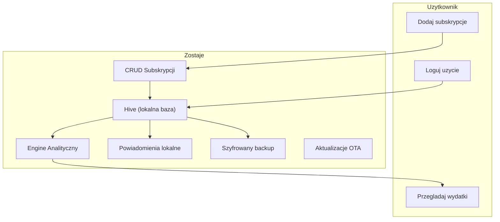

# Architektura

> **Powiazane:** [Roadmap](roadmap.md) | [Baza Danych](database.md) | [Bezpieczenstwo](security.md)
> | [Konwencje](standards/conventions.md)
>
> **ADR:** [ADR-001 Hive JSON bez code-gen](adr/ADR-001-hive-json-bez-code-gen.md)

---

## Przeglad Systemu



### Przeplyw danych

1. **CRUD subskrypcji:** Uzytkownik dodaje/edytuje subskrypcje -> zapis do Hive
2. **Usage tracking:** Uzytkownik loguje uzycie ("Uzylem dzisiaj") -> zapis do Hive
3. **Analityka:** Engine oblicza: total miesieczny, koszt/uzycie, ghost subscriptions, trendy
4. **Powiadomienia:** Lokalne notyfikacje o zblizajacych sie odnowieniach i ghost alerts
5. **Backup:** Eksport szyfrowany (AES-256-GCM) do pliku

---

## Stack Technologiczny

| Warstwa | Technologia |
|---------|-------------|
| **Framework** | Flutter (Dart) |
| **UI** | Material Design 3 — "Aurora", jeden ciemny motyw (ADR-005); design tokens + straznik (ADR-007) |
| **Lokalna baza** | Hive (NoSQL, offline-first) |
| **State management** | ChangeNotifier + Provider |
| **Szyfrowanie** | AES-256-GCM (pointycastle) |
| **Aktualizacje** | OTA (ota_update + version.json) |
| **Wykresy** | fl_chart |
| **Powiadomienia** | flutter_local_notifications |
| **PDF** | pdf + printing |
| **Ikony** | Lucide Icons Flutter |

---

## Struktura katalogow

```text
lib/
├── config/
│   └── app_config.dart          # Build-time config (channels, URLs)
├── controllers/
│   ├── subscription_controller.dart # Stan subskrypcji (CRUD + analytics)
│   ├── budget_controller.dart   # Stan budzetu domowego (CRUD + agregaty), aktywny zakres, odhaczenia platnosci, koperta
│   ├── plan_controller.dart     # Plan roczny aktywnego budzetu (ADR-035): pozycje, miesiace, karta, plan na kolejny rok
│   └── receipt_scan_controller.dart # Skan paragonow AI: kolejka pozycji oczekujacych + OCR w tle (ADR-013)
├── models/
│   ├── subscription.dart        # Glowna encja + PaymentMethod
│   ├── category.dart            # Kategorie subskrypcji
│   ├── usage_event.dart         # Logowanie uzycia
│   ├── budget_entry.dart        # Pozycja budzetu (wplyw/cykliczny/biezacy/rata/przelew) — ADR-018
│   ├── plan_position.dart       # Plan roczny: pozycja z miesiacami „RRRR-MM → kwota" (ADR-035, Faza 16 w toku)
│   └── pending_receipt_scan.dart # Paragon rozpoznany ze zdjecia, czeka na zatwierdzenie (lokalny, poza bilansem)
├── utils/
│   ├── cycle_math.dart          # Wspolna normalizacja cyklu -> kwota/mies + projekcja wystapien (ADR-020)
│   ├── expenses_filter.dart     # Reguly widocznosci listy „Cykliczne"/„Wplywy" (typ, kategoria, czas, ukryte) — ADR-027
│   └── credit_group.dart        # Role pozycji karty (splata / lustro / pozyczka) + zwijanie ich w jeden wiersz listy (ADR-034)
├── services/
│   ├── app_logger.dart          # Circular log buffer
│   ├── backup_crypto_service.dart # Szyfrowanie kopii (AES-256-GCM) + kod odzyskiwania (ADR-024)
│   ├── cloud_backup_service.dart # Kopia w ukrytym folderze na Dysku Google, automat raz na dobe (ADR-024)
│   ├── recovery_key_vault.dart  # Sejf na kod odzyskiwania w koncie Google (Block Store)
│   ├── storage_service.dart     # Hive + cache + CRUD
│   ├── analytics_service.dart   # Obliczenia subskrypcji: totale, trendy, breakdown
│   ├── budget_service.dart      # Agregacja budzetu (wplywy/koszty/surplus/bilans)
│   ├── plan_conversion.dart     # Konwersja starych pozycji na plan roczny + raport zgodnosci (ADR-035); stare dane nietkniete
│   ├── plan_service.dart        # Obliczenia planu: kwoty okresu, sumy miesiaca, statystyki roku, kalendarz, subskrypcje w miesiacach
│   ├── excel_service.dart       # Import/eksport .xlsx (subskrypcje + budzet)
│   ├── ai_engine_service.dart   # Mostek do Lokalnego Silnika AI (kanal platformowy -> usluga AIDL silnika)
│   ├── receipt_scan_service.dart # Parser odpowiedzi silnika (JSON paragonow) + dopasowanie kategorii
│   ├── text_ocr_service.dart    # Szybka sciezka: zwykly OCR tekstowy (ML Kit bundled) + obroty zdjecia
│   ├── receipt_text_parser.dart # Szybka sciezka: reguly (paragon fiskalny, zrzut platnosci) — ADR-017
│   ├── receipt_crop_service.dart # Przyciecie zdjecia paragonu (natywny uCrop, kadr wolny)
│   ├── sync_crypto_service.dart # Synchronizacja: klucz z hasla + szyfrowanie paczki (ADR-009)
│   ├── sync_merge.dart          # Synchronizacja: scalanie LWW + nagrobki + snapshot
│   ├── sync_service.dart        # Synchronizacja: orkiestracja (pull/scal/push CAS) + RPC relay
│   ├── notification_service.dart # Lokalne powiadomienia
│   ├── update_service.dart      # OTA updates
│   └── pdf_export_service.dart  # Eksport raportu PDF
├── theme/
│   └── app_theme.dart           # Aurora: AppColors/AppRadii/AppSemanticColors + ThemeData (ADR-005/007)
├── screens/
│   ├── dashboard_screen.dart    # Zakladka „Budzet": pod-zakladki Statystyki (rok planu) / Kalendarz (platnosci) — ADR-035
│   ├── planning_screen.dart     # Zakladka „Planowanie": plan roczny — wplywy, wydatki, karta, subskrypcje (ADR-035)
│   ├── plan_position_screen.dart # Szczegoly pozycji: 12 miesiecy roku, edycja jednego albo kilku zaznaczonych
│   ├── plan_position_form_screen.dart # Formularz pozycji planu (nowa: kwota + siatka miesiecy; edycja: dane wspolne)
│   ├── card_loan_form_screen.dart # Pozyczka z karty: para pozyczka–splata po okresie bezodsetkowym
│   ├── plan_copy_year_screen.dart # „Zaplanuj kolejny rok" na bazie poprzedniego
│   ├── spending_screen.dart     # „Biezace": wejscie do Plannera -> karta miesiaca -> lista wydatkow (ADR-011)
│   ├── spending_planner_screen.dart # Planner: koperta „Na biezace wydatki" (ADR-012) — wejscie z Biezacych i z Planowania
│   ├── add_spending_screen.dart # Formularz wydatku biezacego (BudgetEntryType.spending)
│   ├── add_subscription_screen.dart # Formularz subskrypcji (zakres bierze z listy, na ktorej stoi uzytkownik)
│   ├── budget_dashboard_screen.dart  # NIEUZYWANY od Fazy 16 (dawne „Cykliczne"/„Wplywy") — do usuniecia w E5
│   ├── add_budget_entry_screen.dart  # Formularz pozycji budzetu (typy planowalne)
│   ├── household_sync_screen.dart # Parowanie QR + haslo, ponowne wystawienie kodu QR, sync budzetu domowego (ADR-009)
│   ├── receipt_archive_screen.dart # Archiwum zdjec paragonow (osobna sekcja Ustawien)
│   ├── data_export_screen.dart  # Eksport/import XLSX (subskrypcje, budzet) + raport PDF — Ustawienia -> Dane
│   ├── settings_screen.dart     # Ustawienia, backup, OTA, synchronizacja domowego
│   ├── dev_tools_screen.dart    # Developer Tools (tylko DEV): override daty, testy powiadomien, podglad surowego odczytu OCR
│   └── plan_conversion_report_screen.dart # Developer Tools: raport konwersji na plan roczny (stary model vs nowy plan)
├── widgets/
│   ├── aurora_background.dart    # Tlo: gradient + 2 statyczne poswiaty (Aurora)
│   ├── frost_card.dart           # Karta „frost" (przezroczystosc + border, BEZ blur)
│   ├── glass_nav_bar.dart        # Plywajaca pigulka nawigacji — jedyny BackdropFilter
│   ├── metric_tile.dart          # Kafel metryki (ikona + kwota + delta)
│   ├── gradient_amount.dart      # Kwota-bohater (ShaderMask gradient)
│   ├── aurora_chip.dart          # Chip filtra (frost / gradient aktywny)
│   ├── aurora_add_menu.dart      # Przycisk „Dodaj" + menu wysuwane w gore (zamiast bottom sheet)
│   ├── subscription_row.dart    # Wiersz subskrypcji w stylu listy budzetu (ADR-027)
│   ├── subscription_stats_view.dart # Limit subskrypcji + koszty okresow probnych („Plan" -> „Limity i okresy probne")
│   ├── category_icons.dart      # Slownik ikon kategorii (wspolny dla list i Ustawien)
│   ├── budget_widgets.dart      # Wspolne widgety budzetu (BudgetSummarySection full/compact, flow/miesiac/karta)
│   ├── plan_widgets.dart        # Planowanie: sekcja z suma, wiersz pozycji z paskiem 12 miesiecy, „Zostaje", koperta, karta
│   ├── cashflow_calendar.dart   # Siatka miesiaca z kropkami wplyw/wydatek
│   ├── spending_chart.dart      # Wykres trendu wydatkow (jedna seria lub kilka + chipy legendy)
│   ├── category_breakdown_chart.dart # Podzial na kategorie (pie)
│   ├── budget_progress_bar.dart # Pasek limitu budzetu (karta z opisem)
│   ├── plan_progress_bar.dart   # Wspolny pasek plan/realny — po przekroczeniu dzieli sie na plan i nadwyzke (ADR-030)
│   ├── filter_bars.dart         # Wspolne paski filtrow list: kategorie i czas (ze skrotem „Dzisiaj")
│   ├── selection_bar.dart       # Tryb zaznaczania wielu pozycji: pasek akcji zbiorczych + wiersz z kolkiem
│   ├── credit_group_row.dart    # Zwiniety wiersz pozycji karty (splaty na „Biezacych", lustra na „Wplywach") — ADR-034
│   ├── month_picker_dialog.dart # Wybor miesiaca (rok + siatka 12 miesiecy, „Dzisiaj")
│   ├── sync_refresh.dart        # Przeciagnij w dol = synchronizacja (RefreshIndicator)
│   ├── workspace_top_bar.dart   # Wspolny pasek: zakres Osobisty/Domowy + opis sekcji
│   ├── flow_view_controls.dart  # Sortowanie i grupowanie w naglowkach sekcji miesiaca
│   └── import_summary_dialog.dart # Wspolny dialog podsumowania importu Excel
└── main.dart                    # Entry point, provider setup (4 zakladki, GlassNavBar; AuroraBackground raz w MaterialApp.builder)
```

---

## Warstwy aplikacji

```
┌─────────────────────────────────────┐
│           UI (Screens + Widgets)     │  Flutter M3, Aurora
├─────────────────────────────────────┤
│          Controllers                 │  SelectionController
├─────────────────────────────────────┤
│          Services                    │  Analytics, Notifications, Backup
├─────────────────────────────────────┤
│          Models                      │  Subscription, Category, UsageEvent
├─────────────────────────────────────┤
│          Storage (Hive)              │  Lokalna baza danych
└─────────────────────────────────────┘
```

### Analytics Engine (nowa warstwa)

Serce aplikacji -- obliczenia finansowe wykonywane lokalnie:

| Obliczenie | Wejscie | Wyjscie |
|------------|---------|---------|
| Monthly total | Wszystkie aktywne subskrypcje | Suma PLN/mies (normalizacja cykli) |
| Category breakdown | Subskrypcje + kategorie | Map<Category, double> |
| Yearly projection | Monthly total * 12 | Suma roczna (figura „/rok") |
| Spending trend | Historia 6 mies. | Lista<MonthlyDataPoint> do wykresu |
| Budget status | Subskrypcje + limit | Procent wykorzystania limitu |

> **Usuniete (2026-06-16):** ghost detection, cost-per-use, prognoza jako osobna karta,
> log uzycia („Uzylem") — uznane za przerost formy. Szczegoly: [roadmap.md](roadmap.md).

---

## Nawigacja (4 zakladki)

> **ADR:** [ADR-026 Gestosc interfejsu](adr/ADR-026-gestosc-interfejsu-bez-paskow-tytulu.md)
> | [ADR-027 Subskrypcje jako sekcja „Wydatkow"](adr/ADR-027-subskrypcje-jako-sekcja-wydatkow.md)

**Bez paskow tytulu.** Ekrany robocze nie maja `AppBar` — nazwa sekcji stoi
w pigulce nawigacji na dole, wiec pasek ja tylko dublowal. Zamiast niego jeden
`WorkspaceTopBar` w powloce: przelacznik zakresu (globalny, wiec nie powtarza sie
juz na kazdym ekranie) i ikona „i" z opisem sekcji. Akcje kontekstowe zeszly do
miejsc, na ktore dzialaja: sortowanie i grupowanie sekcji miesiaca do naglowkow
„Platnosci" i „Podsumowanie miesiaca" (`FlowViewControls`), a sortowanie listy
pozycji — nad te liste. Podekrany Ustawien zachowuja `AppBar` (przycisk powrotu).
Powloka opakowuje tresc w `SafeArea(bottom: false)` — bez paska tytulu nic innego
nie chroni jej przed paskiem stanu telefonu.

**Paski systemowe (stan i nawigacja)** deklaruje `AnnotatedRegion` w
`MaterialApp.builder` (`systemOverlayStyleFor(palette)` w `app_theme.dart`), a nie
`SystemChrome` — ekran z wlasnym `AppBar` nadpisuje styl na czas swojego zycia,
po powrocie znow obowiazuje deklaracja z powloki. To druga polowa ADR-026: gdy
zniknely paski tytulu, zniklo tez jedyne miejsce, ktore mowilo systemowi, czy
ikony maja byc ciemne czy biale — na jasnym motywie potrafily byc biale na bialym.
Ten sam styl jest w `appBarTheme.systemOverlayStyle` (podekrany), a klatke
startowa (przed pierwsza klatka Fluttera) pokrywa `windowLightStatusBar`
w `android/app/src/main/res/values{,-night}/styles.xml`.

Kolejnosc (ADR-035): Budzet | Planowanie | Biezace | ⋮ Ustawienia — przeglad
planu, sam plan (wplywy, wydatki, karta i subskrypcje na jednym ekranie), potem
datowane wydatki. „Wplywy" i „Cykliczne" zlaly sie w „Planowanie" (do 2026-10
osobne zakladki — ADR-019/027/032). Separator oddziela Ustawienia od trojki
funkcyjnej (`GlassNavBar` liczy go dynamicznie). Indeks zakladki Biezace jest
stala `_spendingTab` w `main.dart` — po „Udostepnij -> Zostaje" ladujemy wlasnie
tam, wiec kolejna zmiana kolejnosci nie moze go rozjechac po cichu. Pasek pokazuje
etykiete TYLKO aktywnej pozycji (reszta to ikony), a `FittedBox(scaleDown)`
chroni pigulke od wyjscia za krawedz na waskim ekranie.

| Zakladka | Tresc |
|----------|-------|
| **Budzet** (przeglad) | Dwie pod-zakladki (ADR-035). **Statystyki** — wybrany rok planu: karta „Srednio miesiecznie" (wplywy, wydatki stale, Planner, subskrypcje, karta netto, zostaje + sumy roczne), wykres 12 miesiecy (wplywy vs wydatki) i podzial wydatkow na kategorie (srednio/mies., z koperta i subskrypcjami); pod spodem „Limity i okresy probne" subskrypcji. **Kalendarz** — dawny „Bilans miesiaca" bez realnego bilansu: siatka miesiaca, „Platnosci" do odhaczenia i „Podsumowanie miesiaca"; dane z planu (miesiace pozycji z dniem platnosci), odnowien subskrypcji i Biezacych (`PlanService.calendarForMonth`). Odhaczenia maja klucz `zakres|id|data`, a pozycje planu zachowaly identyfikatory starych pozycji — odhaczenia sprzed przebudowy zostaly. Porownania plan/realne, podsumowanie roczne i „poczatek ewidencji" usuniete (ADR-028/029 zastapione) |
| **Planowanie** | Plan roczny aktywnego budzetu (ADR-035): sekcje **Wplywy · Wydatki** (z koperta Planner przypieta na gorze) **· Karta kredytowa · Subskrypcje** i karta „Zostaje" dla okresu. Filtr czasu bez „Wszystkie lata": rok = srednie miesieczne, miesiac = kwoty tego miesiaca (pozycja widoczna, gdy w nim obowiazuje); „Dzisiaj", kategorie z podgrupami, sortowanie, „pokaz ukryte". Wiersz pozycji ma pasek 12 kratek (miesiace roku). Tap → szczegoly pozycji: 12 miesiecy wybranego roku, kazdy z kwota i dniem; przytrzymanie = zaznaczanie miesiecy (ustaw kwote / dzien / usun z planu). Formularz nowej pozycji: kwota + siatka miesiecy (caly rok, co kwartal, raty od pierwszego zaznaczonego). „Zaplanuj kolejny rok" przenosi miesiace i kwoty (konczace sie raty domyslnie odznaczone). **Pozyczka z karty** — para pozycji (pozyczka w miesiacu uzycia, splata po okresie bezodsetkowym) spieta `linkId`, liczona osobno jako „karta netto". Subskrypcje zostaja osobnym modulem — w planie kwota miesiaca z ich cyklu (okres probny i po anulowaniu = 0). Zaznaczanie wielu pozycji: kategoria, metoda, ukryj/przywroc, usun |
| **Biezace** (dawniej „Rachunki") | Datowane wydatki jednorazowe (`billPayment`, ADR-018): zakupy, paliwo, wyjscia, zajecia, wieksze jednorazowe. Uklad jak na liscie „Cykliczne": **paski filtrow** (kategorie + czas ze skrotem „Dzisiaj"), **karta „Planner"** (suma planu, wejscie do `BillsPlannerScreen`, ADR-012) i **naglowek sekcji „Biezace"** z suma pozycji AKTUALNIE widocznych po filtrach; przy wybranym jednym miesiacu naglowek dokłada porownanie z koperta (pasek plan/realny). Domyslny filtr to biezacy miesiac, ale „Wszystkie lata" otwieraja cale archiwum. Sortowanie (data / kwota / A-Z) przyklejone na koncu paska filtrow. **Zaznaczanie wielu pozycji** (dlugie przytrzymanie): pasek zaznaczania ZASTEPUJE pasek kategorii, a akcje zbiorcze to kategoria, metoda platnosci, data (przenosi wydatek do innego miesiaca razem z odhaczeniem platnosci), **scalenie w jeden wpis** i usuniecie. **Scalanie** (ADR-034): suma kwot, data NAJSTARSZEJ pozycji, wzorzec nazwy/kategorii/metody wybierany z listy zaznaczonych; formularz jest podgladem propozycji (Anuluj nie rusza niczego), a zapis tworzy wpis i kasuje zrodla jedna operacja. Pozycje spiete (`creditLinkId` karty, `linkId` przelewu) sa ODRZUCANE — ich usuniecie kasuje kaskada pozycje spoza zaznaczenia. **Splaty karty** tej samej metody, miesiaca i waluty rysuja sie jako **jeden zwiniety wiersz z suma** (prog 2 pozycje, rozwiniecie tapnieciem, w trybie zaznaczania zawsze rozwiniete) — to wylacznie sposob rysowania listy, dane i sumy sekcji zostaja bez zmian. „Dodaj wydatek"; **skan paragonu AI** (aparat/galeria/Udostepnij) z sekcja „Do zatwierdzenia" (miniatura + Zatwierdz/Edytuj/Odrzuc; tap w miniature -> podglad z „Przytnij") — ADR-011, ADR-013 |
| **Ustawienia** | Trzy sekcje. **Personalizacja**: wyglad, waluta i limit, **wybor budzetow** (tryb: Osobisty / Domowy / oba — ADR-014), powiadomienia, **kategorie i metody platnosci** (slowniki, ktorymi uzytkownik opisuje SWOJ budzet — stad przy personalizacji, nie przy danych). **Dane**: **Asystent AI** (opt-in wspomagania skanu silnikiem), **Archiwum paragonow** (zapis zdjec do `Documents/<podfolder>`), **Budzet domowy** (parowanie i synchronizacja), **Backup** (kopia zapasowa i odtwarzanie) oraz **Eksport/import danych** (XLSX subskrypcji i budzetu w OBIE strony, raport PDF — wczesniej ikony w paskach ekranow; arkusz to nie kopia zapasowa: import DOKLADA pozycje, nie odtwarza zdjec, odhaczen ani ustawien). **Aplikacja**: **aktualizacje OTA inline**, polityka prywatnosci, Developer Tools (tylko DEV). Karty frost |

**Tryb budzetu (ADR-014):** globalny zakres w `BudgetController` ma tryb (`budgetMode`,
lokalny). `both` = przelacznik zakresu na kartach + swipe zmienia zakres (`ScopeSwipeArea`).
Tryb jednozakresowy (`personalOnly`/`householdOnly`) chowa przelacznik (`scopeSelectable`),
a `ScopeSwipeArea(enabled: false)` oddaje swipe dziecku — w Budzecie `TabBarView`
przelacza Statystyki/Kalendarz. Dane obu zakresow zostaja; tryb je tylko chowa/odslania.

**Rachunek auto-oplacony:** przy tworzeniu `billPayment` (log JUZ zaplaconej pozycji,
ADR-008) `BudgetController.create` od razu ustawia jego stan „wykonane" w platnosciach
miesiaca (ten sam klucz co kalendarz) — bez recznego odhaczania.

---

## Domena Budzet domowy (rownolegla warstwa)

> **ADR:** [ADR-029 Podsumowanie roczne i poczatek ewidencji](adr/ADR-029-podsumowanie-roczne-i-poczatek-ewidencji.md)
> | [ADR-028 Plan vs rzeczywistosc na wykresach](adr/ADR-028-plan-vs-rzeczywistosc-na-wykresach.md)
> | [ADR-027 Subskrypcje jako sekcja „Wydatkow"](adr/ADR-027-subskrypcje-jako-sekcja-wydatkow.md)
> | [ADR-023 Rozlaczne strumienie wydatkow](adr/ADR-023-rozlaczne-strumienie-wydatkow.md)
> | [ADR-020 Cykl „wybrane miesiace roku"](adr/ADR-020-cykl-wybrane-miesiace-roku.md)
> | [ADR-018 Scalenie wydatku jednorazowego z rachunkiem](adr/ADR-018-scalenie-wydatku-jednorazowego-z-rachunkiem.md)
> | [ADR-004 Model budzetu domowego](adr/ADR-004-model-budzetu-domowego.md)
> | [ADR-008 Rachunek zmienny: surplus (plan) vs bilans miesiaca (realny)](adr/ADR-008-rachunek-zmienny-surplus-vs-bilans.md)
> | [ADR-011 Rachunki (realny log) + scalenie typow cyklicznych](adr/ADR-011-rachunki-realny-log-i-scalenie-typow-cyklicznych.md)
> | [ADR-012 Koperta „Na rachunki" jako lista pozycji](adr/ADR-012-koperta-na-rachunki-lista-pozycji.md)
> | [ADR-032 „Biezace" i „Cykliczne" zamiast „Rachunkow"](adr/ADR-032-biezace-i-cykliczne-zamiast-rachunkow.md)
> | [ADR-033 Karta kredytowa: pozyczka i splata](adr/ADR-033-karta-kredytowa-pozyczka-i-splata.md)
> | [ADR-034 Scalanie wydatkow i zwijanie splat karty](adr/ADR-034-scalanie-wydatkow-i-zwijanie-splat-karty.md)

> **Uwaga do starszych ADR:** dokumenty ADR-008/011/012/018/019 uzywaja nazwy
> „Rachunki" — to zapis historyczny, nie blad. Dzisiejsza nazwa tej sekcji to
> **„Biezace"**, a koperty **„Na biezace wydatki"** (ADR-032). Slownik nazw kodu
> i granice formatu zapisu opisuje ADR-032.

Budzet jest **osobny od subskrypcji** — nie modyfikuje wydanego modulu, tylko
dodatkowo czyta subskrypcje jako strumien kosztow.

**Dwa zakresy = dwa boxy** (ADR-006): osobisty (`budget_entries`, lokalny) i domowy
(`household_budget_entries`, przyszla synchronizacja). `BudgetController` trzyma aktywny
`BudgetScope` — **jeden globalny tryb Osobisty/Domowy dla calej apki**: przelacznik +
**swipe poziomy** na kazdym ekranie (Budzet, Biezace, Cykliczne, Subskrypcje czytaja
ten sam zakres). Ten sam silnik liczy oba. Kategorie i metody platnosci to slowniki
**wspoldzielone** (subskrypcje + pozycje budzetu obu zakresow + koperta „Na biezace") —
liczniki i kaskady rename/usun w Ustawieniach obejmuja wszystkie te zrodla.

```
BudgetController (ChangeNotifier, aktywny BudgetScope)
   │  nasluchuje SubscriptionController
   ▼
BudgetService  ──►  BudgetEntry[]  (box: budget_entries | household_budget_entries)
   │                          + subskrypcje danego zakresu (Subscription.scope)
   └──►  AnalyticsService.getMonthlyTotal(subscriptions)  ◄─ integracja
```

**Cykle platnosci (ADR-020):** obok `weekly/monthly/quarterly/yearly/custom (dni)`
jest tryb **`monthsOfYear`** — lista miesiacow platnosci (`cycleMonths`, np. 1,4,9)
ze wspolnym dniem z daty-kotwicy. Pokrywa „co N miesiecy" dla N dzielacego 12
(co 2 = szesc miesiecy, co 4 = trzy, co pol roku = dwa); presety w formularzu tylko
wypelniaja te liste. Kwota/mies = kwota x liczba miesiecy / 12. Dotyczy pozycji
budzetu i subskrypcji (wspolna matematyka w `cycle_math`).

**Regula wyboru sekcji (intencja uzytkownika):** sekcja, do ktorej trafia pozycja,
JEST wyborem sposobu liczenia. **Wydatki cykliczne** = koszt usredniony (kwota x
liczba platnosci / 12), niezaleznie od tego, w ktorym miesiacu dodano pozycje —
to wlasciwe zachowanie przy planowaniu miesiecznego budzetu. **Biezace** = koszt
datowany, uderzajacy w bilans konkretnego miesiaca. Ta os JEST podzialem zakladek
(ADR-032): nazwy „Biezace" i „Cykliczne" mowia wprost, czym te sekcje sie roznia.
Stad scalenie typow z ADR-018:
„rachunek" i „wydatek jednorazowy" byly dwiema nazwami tej samej, datowanej strony
tego podzialu.

**Model czasu (hybryda):**
- Rdzen usredniony: `surplus = wplywy - (koszty cykliczne + subskrypcje)`
- Jednorazowe (wplyw/wydatek): przypiete do daty, koryguja `balanceForMonth`
- Roznice „bilans − saldo" rozbija `balanceBreakdownForMonth` (jednorazowe,
  korekty kwot, korekty rat) — suma delt = `balanceForMonth − monthlySurplus`
- `BudgetEntry.appliesToMonth` = przynaleznosc pozycji do snapshotu miesiaca
  (filtr czasu w Budzecie): cykliczne zawsze, jednorazowe = swoj miesiac, raty = okno

**Przelew do domowego** (`householdTransfer`): koszt w osobistym + lustrzany wplyw w
domowym, spiete `linkId` (kaskada edycji/usuwania; lustro read-only). Patrz
[ADR-006](adr/ADR-006-budzet-domowy-osobny-zbior.md).

**Karta kredytowa (ADR-033):** metoda platnosci z flaga `isCreditCard` i liczba
`graceDays`. Karta POZYCZA pieniadze, wiec operacja nia rodzi zestaw pozycji
spietych `creditLinkId` (osobne pole, bo `linkId` laczy ROZNE zakresy, a te
pozycje siedza w jednym):
- **wplyw z karty** -> wplyw + splata za `graceDays` dni (netto zero),
- **zakup karta** -> zakup + lustrzany wplyw „Karta: …" tego samego dnia +
  splata za `graceDays` dni. Bez tego wplywu ten sam zakup obciazalby budzet
  DWA razy — raz jako zakup, raz jako splata.

Automat obejmuje tylko `spending` i `oneTimeIncome`; cykliczne i raty wchodza do
planu, wiec doklejanie do nich splaty rozjechaloby „zostaje/mies".

Poniewaz model jest 1:1 (kazdy zakup ma WLASNA splate), a bank sciaga jedna kwote
za okres, lista „Biezace" zwija splaty jednej karty w jeden wiersz z suma
(`utils/credit_group.dart`, ADR-034). Splata nie ma w danych wlasnego znacznika —
rozstrzyga data: w obrebie jednego `creditLinkId` splata jest wydatek o
NAJPOZNIEJSZEJ dacie (remis dat = nie zwijamy). Nowego pola nie dokladamy
swiadomie: pozycje jada miedzy telefonami, a starsza wersja skasowalaby nieznane
pole po cichu.

**Planner w synchronizacji (ADR-022):** koperta „Na biezace wydatki" zakresu DOMOWEGO jedzie
w tej samej paczce co pozycje — jako **sekcja opcjonalna przy tej samej wersji paczki**,
zeby telefony mogly aktualizowac sie w roznym czasie. Pozycje Plannera maja `updatedAt`
i nagrobki (scalanie per pozycja). Brak sekcji w paczce = BRAK INFORMACJI (lokalny
Planner zostaje), pusta lista w paczce = „Planner jest pusty". Planner osobisty zostaje
lokalny.

**Uruchomienie synchronizacji:** standardowy gest **przeciagnij w dol**
(`SyncRefresh` = `RefreshIndicator`) na listach Budzetu, Biezacych, Cyklicznych
cyklicznych i Wplywow — zastapil przycisk „Synchronizuj teraz" w pasku, o ktorym
trzeba bylo wiedziec. Gest dziala takze BEZ sparowania (przelicza dane lokalne),
zeby pociagniecie listy nigdy nie wygladalo na zepsuta apke; komunikat pokazuje
sie tylko po realnej synchronizacji. Listy maja `AlwaysScrollableScrollPhysics`,
inaczej gest znika, gdy tresc nie wypelnia ekranu. Poza gestem sync leci
automatycznie (start aplikacji, powrot do niej, zmiana w budzecie domowym).

**Synchronizacja domowego (ADR-009):** box `household_budget_entries` jest opcjonalnie
synchronizowany miedzy urzadzeniami przez relay E2E (Supabase) — bez kont, parowanie
QR + haslo. Serwer jest slepy (szyfrowanie end-to-end). Scalanie „ostatnia zmiana
wygrywa" per pozycja (`updatedAt`) + nagrobki (`deleted`). Osobisty zostaje lokalny.
Patrz [ADR-009](adr/ADR-009-synchronizacja-budzetu-domowego-relay-e2e.md) i
[security.md](security.md).

**Przeniesienie wydatku miedzy budzetami:** `BudgetController.moveToScope`
przenosi pozycje osobisty ↔ domowy (akcja w formularzu edycji wydatku, tylko
gdy oba budzety sa w uzyciu). Zakres nie jest polem pozycji, tylko wynika
z pudelka, wiec przeniesienie = zapis w nowym + usuniecie ze starego. Trzy
rzeczy jada razem z pozycja: **nagrobek** przy wyjsciu z domowego (bez niego
synchronizacja przywroci pozycje z serwera i policzy ja w obu budzetach),
**zdjecie rachunku** (mapa po `id`) i **odhaczenie platnosci** (klucz zawiera
zakres ORAZ `id`). Pozycja dostaje NOWE `id` — nagrobek zostaje przy starym,
wiec nie ma jak sie z nia zderzyc, gdyby wrocila. Przelewy miedzy budzetami
(`householdTransfer` z `linkId`) sa odrzucane: to para pozycja + lustro.

**Slowniki w paczce (ADR-025):** kategorie i metody platnosci jada jako sekcja
opcjonalna `dictionaries` — bez nich pozycja u drugiej osoby wskazywala na
nieistniejaca kategorie (znikala z karty, wpadala do „Inne"), a platnosc
automatyczna udawala manualna (metoda jest wskazywana po NAZWIE, wiec brak wpisu
= brak `isAutomatic`). Jada **tylko wpisy uzywane przez budzet domowy** —
slownik jest wspoldzielony z osobistym i subskrypcjami, wiec prywatne kategorie
nie opuszczaja telefonu. Scalanie LWW po nowym polu `updatedAt` (brak = epoka
zero), **bez usuwania zdalnego**; metody dopasowywane po nazwie, a kategorie
o tej samej nazwie kanonizowane do mniejszego `id` (wybor niezalezny od
telefonu, wiec pozycje nie przepinaja sie w kolko).

---

## Skan paragonow — Lokalny Silnik AI (ADR-013)

> **ADR:** [ADR-013 Skan rachunkow lokalnym silnikiem AI](adr/ADR-013-skan-rachunkow-lokalny-silnik-ai.md)
> | [ADR-015 Przycinanie zdjecia rachunku (uCrop)](adr/ADR-015-przycinanie-zdjecia-rachunku-ucrop.md)
> | [ADR-016 Skan w usludze pierwszoplanowej](adr/ADR-016-skan-rachunku-usluga-pierwszoplanowa.md)
> | [ADR-017 Szybka sciezka OCR przed silnikiem](adr/ADR-017-szybka-sciezka-ocr-przed-silnikiem-ai.md)
> | Silnik: repo `karton-ai` (osobna apka, model Gemma 4 E4B on-device)

Zero chmury: zdjecie rachunku idzie do apki-silnika NA TYM SAMYM telefonie
(usluga AIDL, straznik podpisu). Klienci — takze build dev Zostaje — binduja
wylacznie pakiet PRODUKCYJNY silnika `app.michalrapala.ai_engine`.

**Skan NIE jest opcja, silnik jest.** Odczyt paragonow i potwierdzen platnosci
robi model OCR wbudowany w APK (ADR-017), wiec skanowanie dziala zawsze — bez
sieci, bez apki silnika i bez zadnego opt-inu (menu „Dodaj", „Udostepnij ->
Zostaje"). Przelacznik **Asystent AI** (`aiAssistantEnabled`, domyslnie OFF)
decyduje wylacznie o tym, czy dokument nierozpoznany regulami idzie do silnika.
Przy wylaczonym asystencie (albo braku modelu) taka pozycja konczy jako
„Uzupelnij recznie" — zostaje w „Do zatwierdzenia" ze zdjeciem i przyciskiem
edycji, wiec rachunek da sie dokonczyc bez zadnego automatu.

```
Zdjecie (aparat / galeria)          Udostepnij -> Zostaje
  │  ReceiptCropService.crop:         │  bez przerywania (fire-and-forget)
  │  natywny uCrop, kadr wolny        │  crop pozniej, z poczekalni
  └──────────────┬────────────────────┘
  │  BillScanController.startScan: kopia do bill_scans/, pozycja "processing"
  ▼
TextOcrService + ReceiptTextParser (szybka sciezka, ~1-2 s, ADR-017)
  │  paragon fiskalny / zrzut platnosci -> pozycja gotowa OD RAZU
  │  brak trafienia ▼
AiEngineService (Dart) ── MethodChannel ──► AiEngineBridge (Kotlin)
  │                                            │ zlecenie (wraca od razu)
  │                                            ▼
  │                              BillScanService (usluga pierwszoplanowa):
  │                              EngineClient.bind + PFD + callback
  │                                            │
  │                                            ▼
  │                              Lokalny Silnik AI: recognizeBill (~30-45 s, CPU)
  │                                            │
  │       ScanResultStore (skrzynka na dysku) ◄┘
  ▼
BillScanParser (JSON -> pola) ──► PendingBillScan "done" (sekcja "Do zatwierdzenia",
  miniatura zdjecia; tap -> podglad + "Przytnij") ──► Zatwierdz/Edytuj -> zwykly
  billPayment | Odrzuc -> kasacja
```

**Praca w tle (ADR-016).** Rozpoznawanie prowadzi natywna usluga pierwszoplanowa
Zostaje (`BillScanService`, powiadomienie „Rozpoznaje rachunek…"), nie warstwa
Dart — inaczej wyjscie z apki konczylo sie ubiciem zbuforowanego procesu przez
system (silnik zajmuje pamiec modelem) i utrata skanu.

**Kolejka rozpoznan jest po stronie uslugi, nie Dart.** `BillScanController`
przepuszcza zdjecia przez szybka sciezke pojedynczo (OCR w procesie apki), ale
nietrafione zleca uslugach OD RAZU i nie czeka na wynik — serializuje je
`BillScanService` (ma wlasna kolejke). Powod: zlecenie musi wyjsc, gdy apka jest
jeszcze na wierzchu, bo Android 12+ blokuje start uslugi pierwszoplanowej z tla.
Wczesniej drugi skan ruszal dopiero po ~45 s (zwykle przy schowanym telefonie),
dostawal odmowe i szedl sciezka awaryjna w procesie apki, skad system wymiatal
go razem z procesem. `activeScanId` = pierwszy z listy zleconych (kolejnosc
`ScanResultStore.inFlightIds()` odpowiada kolejnosci pracy uslugi), a limit czasu
(`_watchdog`, 420 s) pilnuje tylko skanu aktualnie liczonego — liczenie go od
zlecenia falszywie zabijaloby pozycje czekajace w kolejce. Wynik trafia do skrzynki
`ScanResultStore` na dysku, wiec przezywa takze zniszczenie ekranu aplikacji;
Dart oproznia skrzynke przy starcie i na ping z warstwy natywnej. Bindowanie do
silnika uzywa `FLAG_INCLUDE_STOPPED_PACKAGES` — bez tego uspiona lub swiezo
zainstalowana apka silnika wymagala recznego uruchomienia przed pierwszym skanem.

**Szybka sciezka (ADR-017).** Zanim ruszy silnik, zdjecie czyta zwykly OCR
tekstowy (`TextOcrService`, model ML Kit wbudowany w APK — bez Google Play
Services i bez sieci) i reguly (`ReceiptTextParser`). Paragon fiskalny
(`SUMA PLN`, data ISO), zrzut platnosci telefonem (kwota `X,XX zl`, „sobota,
25 lip") oraz **faktura** sa odczytane w ~1-2 s, z data wzieta wprost
z dokumentu.

Reguly faktury opieraja sie na ETYKIETACH, nie na pozycji tekstu: kwota z
„Pozostalo/Razem do zaplaty" (szukana tylko w przod — nad ta etykieta stoi ogon
tabeli VAT), a gdy jej nie ma albo wynosi 0,00 (dokument juz oplacony) — suma
przy „Razem" (z okna bierzemy NAJWIEKSZA kwote, bo obok stoja netto i podatek).
Data: termin platnosci, potem data wystawienia, potem data sprzedazy; szukana
w obie strony, bo w ukladzie dwukolumnowym etykieta bywa POD wartoscia.
Wystawca: linia przy „Sprzedawca" (pod nia, a gdy tam sa dane rejestrowe — nad).
Daty sa wycinane przed szukaniem kwot, bo „15.09.2023" pasuje do wzorca kwoty
jako „15,09". Regul NIE opieramy na naglowku „wartosc brutto" — to etykieta
kolumny, pod ktora ida kolejno netto, podatek i brutto. Nietrafiony
wzorzec albo brak pewnej kwoty → dokument przejmuje silnik AI. Przy braku
trafienia zdjecie jest jeszcze obracane (90/270/180 stopni) — paragony
fotografuje sie w poprzek.

**Rok w dacie.** Silnik nie mial zegara: gdy na dokumencie widnieje sam dzien
i miesiac, model rok zmyslal (zwykle rok poprzedni). Od wersji silnika z promptem
`Prompts.billOcr(today)` model dostaje **dzisiejsza date z zegara telefonu**
(silnik dziala na tym samym urzadzeniu, wiec interfejs AIDL zostaje bez zmian
i klienci nie wymagaja przebudowy) wraz z regula: uzupelnij brakujacy rok, ale
nigdy nie wstawiaj dzisiejszej daty jako zapchajdziury. Kotwica po stronie apki
zostaje jako siatka bezpieczenstwa — prompt nie daje gwarancji, a starsze wersje
silnika chodza dalej. Szybka sciezka bierze rok
z dokumentu (paragon — data ISO; zrzut platnosci — dzien tygodnia jednoznacznie
wskazuje rok). Dla wyniku z silnika `BillScanParser` dokłada rok wiarygodny
wobec „dzisiaj": data spoza okna −9/+3 miesiecy zachowuje dzien i miesiac,
a rok dostaje najblizszy dzisiejszej dacie (remis → rok biezacy). Okno musi byc
krotsze niz rok, inaczej „ta sama data rok temu" przechodzi jako wiarygodna.

Pozycje oczekujace sa LOKALNE (settings, poza sync/backupem/bilansem) — do
budzetu wchodza dopiero po zatwierdzeniu. Duplikaty plikow AIDL w
`android/app/src/main/aidl/` musza byc identyczne z repo silnika.

**Przycinanie zdjecia (uCrop, bez Google Play Services).** Zdjecie z aparatu i
galerii jest docinane od razu po wyborze — sam paragon, bez reki i tla: mniej
szumu dla silnika i lzejszy plik w archiwum. Zdjecie z „Udostepnij" leci prosto
do rozpoznania (nie przerywamy fire-and-forget), a docic je mozna pozniej z
poczekalni: tap w miniature -> podglad -> „Przytnij". Crop z poczekalni podmienia
TYLKO obraz (`BillScanController.recrop` zapisuje nowy plik i kasuje stary, o ile
nie dzieli go inna pozycja) — **nie uruchamia OCR ponownie**, wiec odczytane pola
zostaja; kto ich nie ma, uzywa „Ponow" i silnik dostaje juz dociety kadr.
Przycinanie jest zablokowane w trakcie rozpoznawania (silnik czyta ten plik).

Crop jest takze w **formularzu edycji** rachunku (`AddBillPaymentScreen`, tap w
miniature). Dwie sciezki zapisu: dla skanu przed zatwierdzeniem docieta sciezka
wraca z formularza (rekord `entry`+`imagePath`) i trafia do prywatnej kopii oraz
archiwum przy `finalizeApproval`; dla juz zapisanego rachunku podmieniana jest
prywatna kopia (`BillScanController.replaceReceiptPhoto`) **i odswiezane
publiczne archiwum**.

**Podmiana w archiwum wymaga pamieci o nazwie pliku.** Nazwa to
`RRRR-MM-DD_Nazwa_Kwota.jpg`, a MediaStore nie nadpisuje po nazwie — dokłada
„nazwa (1).jpg". Dlatego przy kazdej archiwizacji zapamietujemy nazwe pod
`entryId` (`archivedReceiptNames` w ustawieniach) i przy nastepnej kasujemy
stary plik PRZED zapisem nowego (natywne `deleteArchivedReceipt`). Bez tej mapy
nie dalo by sie trafic we wlasciwy plik, bo po edycji rachunku nazwa jest inna.
Blad archiwizacji nie cofa dociecia — archiwum to kopia dodatkowa. Usuniecie
rachunku czysci mape, ale **nie kasuje pliku z archiwum**: to trwaly slad.

Poniewaz `startScan` kopiuje zdjecie raz, a OCR, prywatna kopia i archiwum biora
ten sam plik — dociecie na wejsciu dziedziczy sie w cala reszte lancucha.

---

## Bezpieczenstwo

> Szczegoly: **[security.md](security.md)**

| Aspekt | Rozwiazanie |
|--------|-------------|
| **Dane lokalne** | Hive (offline-first, zero cloud) |
| **Bez kont** | Brak rejestracji, brak logowania |
| **Backup** | AES-256-GCM (device key lub haslo) |
| **Prywatnosc** | Dane finansowe nigdy nie opuszczaja urzadzenia |

---

> **Ostatnia aktualizacja:** 2026-10-06
